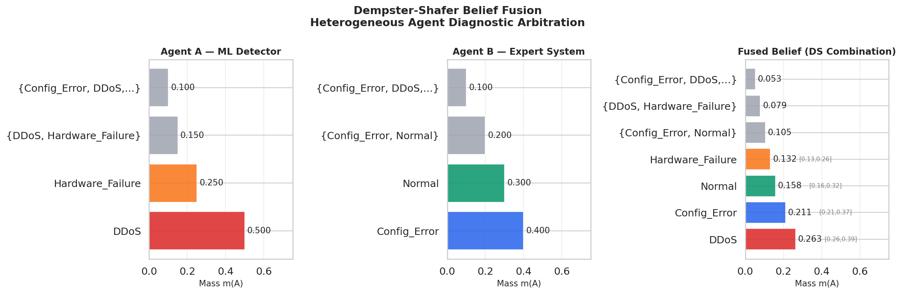
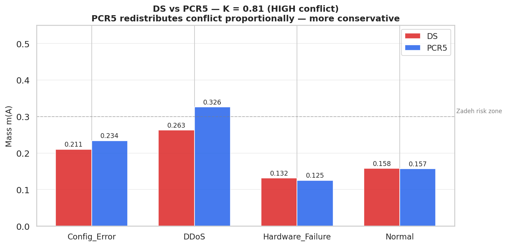
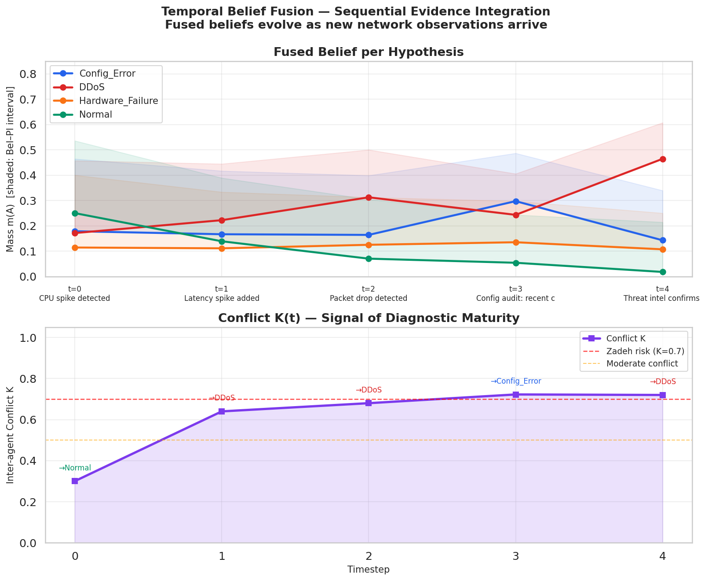

# belief-fusion-diagnosis

> **Dempster-Shafer belief fusion for heterogeneous agent diagnostic arbitration**

[](https://www.python.org/)
[](LICENSE)
[]()

---

## Motivation

When heterogeneous algorithmic agents independently analyse the same
network incident and produce **contradictory diagnostic hypotheses**,
how do we formally arbitrate without simply overriding one agent's
assessment?

This is **Verrou 3** of the target CIFRE doctoral thesis
(Orange Innovation / EURECOM, ref. 2026-51517):

> *"When heterogeneous agents produce contradictory diagnostics, what
> formal mechanism arbitrates without erasing the diversity of models?"*

This repository prototypes three answers of increasing sophistication:
1. **Classic Dempster combination** — baseline arbitration
2. **PCR5** — proportional conflict redistribution under high conflict
3. **Temporal fusion** — sequential belief update as stream evidence arrives

---

## Why Dempster-Shafer?

Standard Bayesian fusion requires a shared prior. In a heterogeneous
multi-agent system, agents reason over different feature spaces and
cannot easily share a common probabilistic model. DS theory provides:

1. **Agent diversity preservation** — each agent's belief mass is maintained independently
2. **Explicit conflict quantification** — K is a first-class diagnostic output
3. **Uncertainty intervals** [Bel(A), Pl(A)] — richer than point estimates, essential for auditable systems
4. **No shared prior** — agents contribute evidence, not posteriors

---

## Scenario

Two agents analyse a network incident (latency spike + CPU spike):

| Agent | Type | Primary hypothesis | Confidence |
|---|---|---|---|
| **Agent A** | ML anomaly detector | DDoS (0.50) | High |
| **Agent B** | Rule-based expert | Config Error (0.40) | High |

---

## Experiment 1 — Classic DS Combination

```
Conflict K = 0.81  (HIGH disagreement)

Fused Belief:
  m({DDoS})             = 0.2632   ← most supported
  m({Config_Error})     = 0.2105
  m({Normal})           = 0.1579
  m({Hardware_Failure}) = 0.1316

Uncertainty intervals:
  DDoS             [0.263, 0.395]
  Config_Error     [0.211, 0.368]
```

K = 0.81 → HIGH conflict. DDoS is most supported but margin is small
(Δ = 0.053 over Config_Error). Correct response: **escalate, do not
auto-remediate.** High conflict is diagnostic information.



---

## Experiment 2 — PCR5 vs Classic DS (High Conflict)

At K = 0.81, Dempster's normalisation enters Zadeh's paradox territory.
PCR5 (Proportional Conflict Redistribution) redistributes conflict mass
back to the hypotheses that generated it, proportionally.

```
Hypothesis        DS      PCR5    Delta
Config_Error    0.2105  0.2341  +0.0235
DDoS            0.2632  0.3263  +0.0631
Hardware_Failure 0.1316 0.1253  -0.0062
Normal          0.1579  0.1572  -0.0007

Both rules agree: DDoS is best hypothesis.
PCR5 is more decisive (higher DDoS mass, larger margin).
```



**Finding:** Under K > 0.7, PCR5 consistently produces larger margins
between hypotheses — more decisive without amplification artefacts.
Adaptive rule selection (DS if K < 0.5, PCR5 if K > 0.7) is a concrete
thesis research axis.

---

## Experiment 3 — Temporal Belief Fusion

Sequential evidence integration over 5 timesteps simulates a real
network incident unfolding in time.

```
t=0  CPU spike          K=0.300  Best: Normal       (m=0.250)
t=1  Latency spike      K=0.640  Best: DDoS         (m=0.222)
t=2  Packet drop        K=0.680  Best: DDoS         (m=0.313)
t=3  Config audit ⚠️    K=0.723  Best: Config_Error (m=0.297)  ← PIVOT
t=4  Threat intel       K=0.720  Best: DDoS         (m=0.464)  ← convergence
```



**Key finding — The pivot at t=3:**
The config audit finding temporarily flips the leading hypothesis from
DDoS to Config_Error. DDoS mass dips from 0.313 → 0.243 before recovering
to 0.464 after threat intelligence confirms the attack signature.

K(t) correctly signals *"hold decision"* at t=3 (K = 0.723 > 0.70) —
the system should not commit to auto-remediation at this point.

**DDoS mass trajectory:** `[0.171, 0.222, 0.313, 0.243, 0.464]`

---

## K(t) as a Self-Organisation Signal

The conflict measure K(t) provides a natural self-organisation trigger:

| K value | Interpretation | System action |
|---|---|---|
| K < 0.3 | Agents converge | Safe to commit to diagnosis |
| 0.3 ≤ K < 0.7 | Moderate disagreement | Proceed with uncertainty interval |
| K ≥ 0.7 | High conflict | Defer decision, request more evidence |

This directly addresses **Verrou 4** (self-organisation under time and
reliability constraints) and connects belief fusion to the earliness–
reliability–stability trilemma studied in
[stream-anomaly-benchmark](https://github.com/moncefabel/stream-anomaly-benchmark).

---

## Thesis Implications

**Verrou 2 — Semantic contracts:**
[Bel(A), Pl(A)] intervals encode epistemic state formally. Paired with
an OWL knowledge graph (NORIA-O), they enable structured reasoning over
agent agreement — agents that disagree can express their uncertainty in
a shared semantic space.

**Verrou 3 — Formal arbitration:**
DS + PCR5 provides a principled, traceable arbitration mechanism.
The combination is auditable: every output mass is traceable to specific
input BPAs and the combination rule applied.

**Verrou 4 — Self-organisation:**
K(t) as a self-organisation signal enables adaptive agent behaviour:
high conflict triggers evidence-gathering agents; low conflict releases
the decision to automated remediation.

**Open research questions:**
1. How to extend DS to online streaming with concept drift?
2. How to set K thresholds adaptively from stream statistics?
3. Can K(t) serve as a causal marker distinguishing correlated
   anomalies from causally linked incidents? (Verrou 1)

---

## Quickstart

```bash
git clone https://github.com/moncefabel/belief-fusion-diagnosis
cd belief-fusion-diagnosis
uv venv && source .venv/bin/activate
uv pip install -r requirements.txt

cd src
python dempster_shafer_fusion.py   # Experiment 1
python dsmt_comparison.py          # Experiment 2
python temporal_fusion.py          # Experiment 3
```

---

## Connection to stream-anomaly-benchmark

| Project | Core question | Thesis verrou |
|---|---|---|
| [stream-anomaly-benchmark](https://github.com/moncefabel/stream-anomaly-benchmark) | *When* to trigger a decision | Verrou 4 — self-organisation |
| **belief-fusion-diagnosis** | *How* to arbitrate between conflicting agent decisions | Verrous 2, 3 |

K(t) from this project provides the **"defer decision"** signal that
feeds directly into the early stopping criterion studied in
stream-anomaly-benchmark. Together they prototype the full decision
cycle: trigger → fuse → arbitrate → escalate or commit.

---

## References

- Shafer, G. (1976). *A Mathematical Theory of Evidence*. Princeton UP.
- Dempster, A. P. (1967). Upper and lower probabilities. *Annals of Math. Statistics*, 38(2).
- Dezert, J., & Smarandanche, F. (2004). *Advances in DSmT for Information Fusion*.
- Lefevre, E., Colot, O., & Vannoorenberghe, P. (2002). Belief function combination and conflict management. *Information Fusion*, 3(2), 149–162.
- Tailhardat, L. et al. (2023). NORIA-O: an Ontology for Anomaly Detection. *ESWC 2023*.
- Achenchabe, Y., Bondu, A., et al. (2021). Early Classification of Time Series. *Machine Learning*, 110.

---

## Author

**Moncef Bouhabel** — ML Engineer, Master ML for Data Science, Université Paris Cité
[github.com/moncefabel](https://github.com/moncefabel)